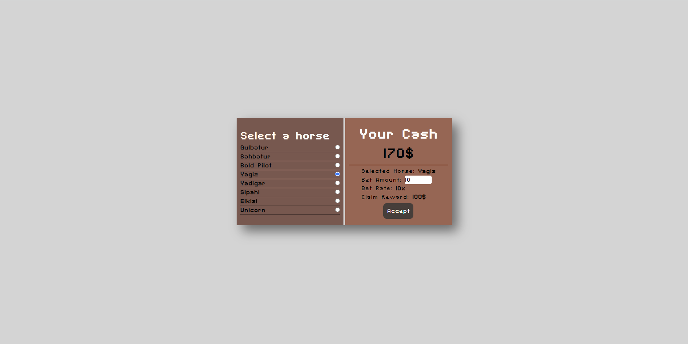
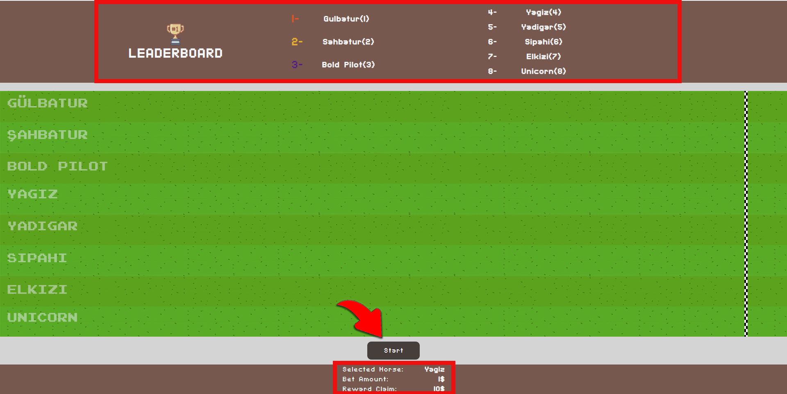

# Patika Protein Vuejs Bootcamp Final Project

## Project Description
In this project, I developed a live-time horse race game that ran 8 horses and 8 straight lines. Before the race starts, you must select a horse and enter the bet amount. If you are out of cash, you can start the game from the beginning by pressing the restart button. After pressing the start button, 3 seconds countdown counts when finished the horses start running. During the run, the speed of the horses is determined randomly at specific intervals. This way, who will win is always determined by the luck factor. There is a leaderboard that changes instantly depending on the position of the horses during the race. The race that starts before all horses cross the line is not over. When the last horse crosses the finish line and the race ends, there is a restart button shows and when it is clicked, the race is ready to start again.

## Instructions
- npm install
- npm run dev

### Techonologies
- Vite - Vue
- SASS
- Tailwind CSS

### Color Palette
```
- 'btnprimary':'#473e3a',
- 'bgprimary': '#7b584e',
- 'bgsecondary': '#9b6753',
- 'gold':'#ef912d',
- 'blackdark':'#9b6753',
```

## Live Demo


<hr>

# Game

## Bet Screen

Before the race start, you can select the horse that you think wins. <b>You can't</b> set the bet amount to more than your balance. Follow the commands below to select your horse and set your bet.

1. Select your horse
2. Set the bet amount
    1. Bet rate is 10x
    2. You can see the possible reward
3. Click the accept button



If you are <b>out of cash</b>, you can <b>restart the game</b> clicking the restart icon. In this way, the game will be restarted again.


<hr>

## Race Screen

Top of the screen you can see the leaderboard. At the bottom side, your bet shows. After clicking the start button 3 seconds countdown starts and the race begins.



After finishing the race you can see the finish times and final leaderboard.

(This is <b>2x times faster</b> than the normal speed)


If your selected horse win the race, you can see how much money you won! <b>GOOD LUCK!</b>

