# Patika Protein Vuejs Bootcamp Final Project

## Project Description
In this project, I developed a live-time horse race game that ran 8 horses and 8 straight lines. Before the race starts, you must select a horse and enter the bet amount. If you are out of cash, you can start the game from the beginning by pressing the restart button. After pressing the start button, 3 seconds countdown counts when finished the horses start running. During the run, the speed of the horses is determined randomly at specific intervals. This way, who will win is always determined by the luck factor. There is a leaderboard that changes instantly depending on the position of the horses during the race. The race that starts before all horses cross the line is not over. When the last horse crosses the finish line and the race ends, there is a restart button shows and when it is clicked, the race is ready to start again.

## Table of Contents

- [Project Description](#Project-Description)
- [Live Demo](#Live-Demo)
- [Installation](#Installation)
    - [Technologies](#Technologies)
    - [Color Palette](#Color-Palette)
    - [Horses](#Horses)
- [Game](#Game)
    - [Bet Screen](#Bet-Screen)
        - [Bet Values](#Bet-Values)
    - [Race Screen](#Race-Screen)
        - [Sections](#Sections)
        - [Race](#Race)
        - [Bet Win](#Bet-Win)


## Live Demo
[](https://app.netlify.com/sites/alihan-horse-race/deploys) <br>
<a href="https://alihan-horse-race.netlify.app/">Live Demo Link</a>

## Installation
- npm install
- npm run dev

### Technologies
- Vite - Vue
- SASS
- Tailwind CSS

### Color Palette
```
- 'btnprimary':'#473e3a',
- 'bgprimary': '#7b584e',
- 'bgsecondary': '#9b6753',
- 'bggreen': '#328827f0',
- 'blackdark':'#9b6753',
```
### Horses

<div>
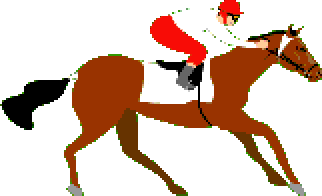 <span style="margin-left:15px"><b>Name:</b> Gulbatur,<b> Color:</b> Red, <b> Racing Line:</b> 1 </span>  <br>
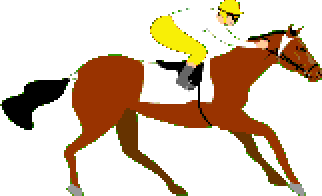<span style="margin-left:15px"><b>Name:</b> Sahbatur,<b> Color:</b> Yellow, <b> Racing Line:</b> 2 </span>  <br>
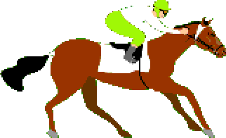<span style="margin-left:15px"><b>Name:</b> Boldpilot,<b> Color:</b> Light Green, <b> Racing Line:</b> 3 </span>  <br>
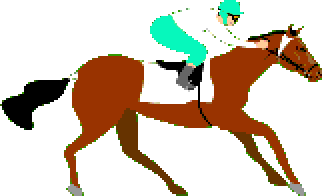<span style="margin-left:15px"><b>Name:</b> Yagiz,<b> Color:</b> Light Turquoise, <b> Racing Line:</b> 4 </span>  <br>
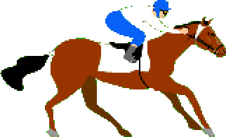<span style="margin-left:15px"><b>Name:</b> Yadigar,<b> Color:</b> Blue, <b> Racing Line:</b> 5 </span>  <br>
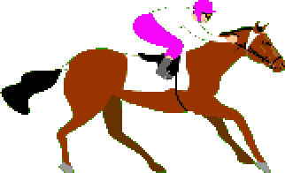<span style="margin-left:15px"><b>Name:</b> Sipahi,<b> Color:</b> Purple, <b> Racing Line:</b> 6 </span>  <br>
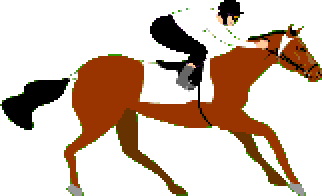<span style="margin-left:15px"><b>Name:</b> Elkizi,<b> Color:</b> Black, <b> Racing Line:</b> 7 </span>  <br>
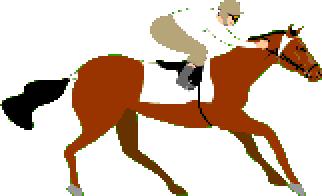<span style="margin-left:15px"><b>Name:</b> Unicorn,<b> Color:</b> Beige, <b> Racing Line:</b> 8 </span>  <br>
</div>

<hr>

# Game

## Bet Screen

Before the race start, you can select the horse that you think wins. <b>You can't</b> set the bet amount to more than your balance. Follow the commands below to select your horse and set your bet.

### Bet Values

1. Select your horse
2. Set the bet amount
    1. Bet rate is 10x
    2. You can see the possible reward
3. Click the accept button
4. Accept the bet if you agree the values are correct.

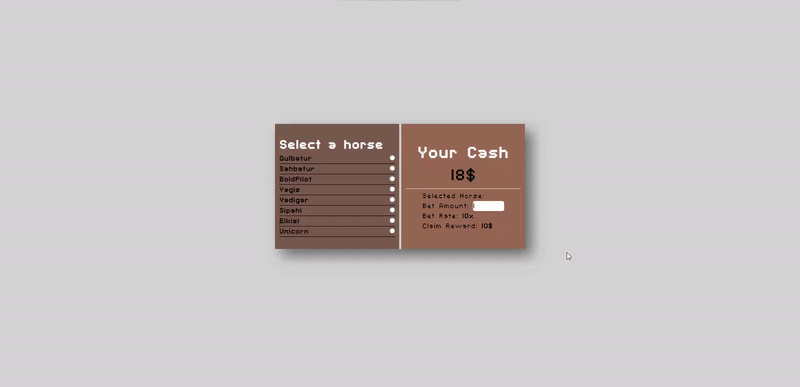

If you are <b>out of cash</b>, you can <b>restart the game</b> clicking the restart icon. In this way, the game will be restarted again.

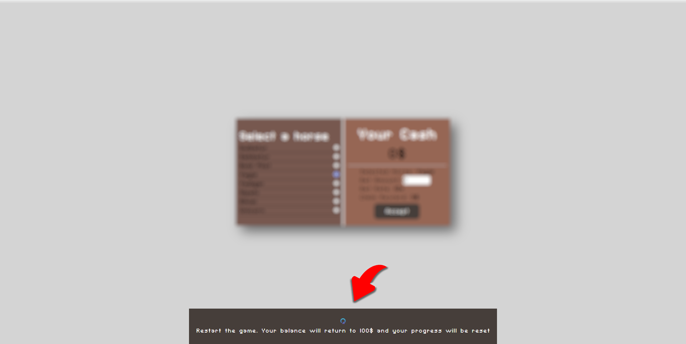

<hr>

## Race Screen

### Sections

Top of the screen you can see the leaderboard. At the bottom side, your bet shows. After clicking the start button 3 seconds countdown starts and the race begins.
<b></b>
<p><b>1-</b> You can follow the race from the live time leaderboard.</p>
<p><b>2-</b> These are the race lines. You can see the horses.</p>
<p><b>3-</b> Start button. Click it and the race starts.</p>
<p><b>4-</b> Your bet screen. You can see the bet options.</p>

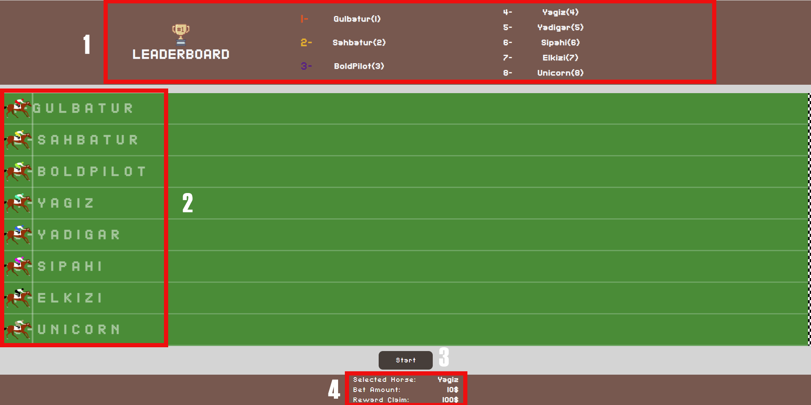

### Race

After finishing the race you can see the finish times and final leaderboard. You can click the restart button to start the race again.

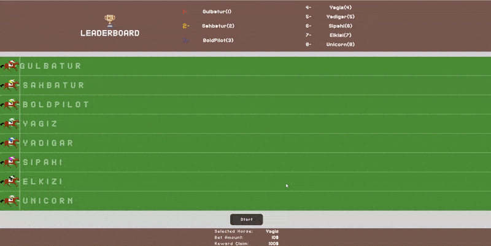

### Bet Win

If your selected horse win the race, you can see how much money you won! <b>GOOD LUCK!</b>

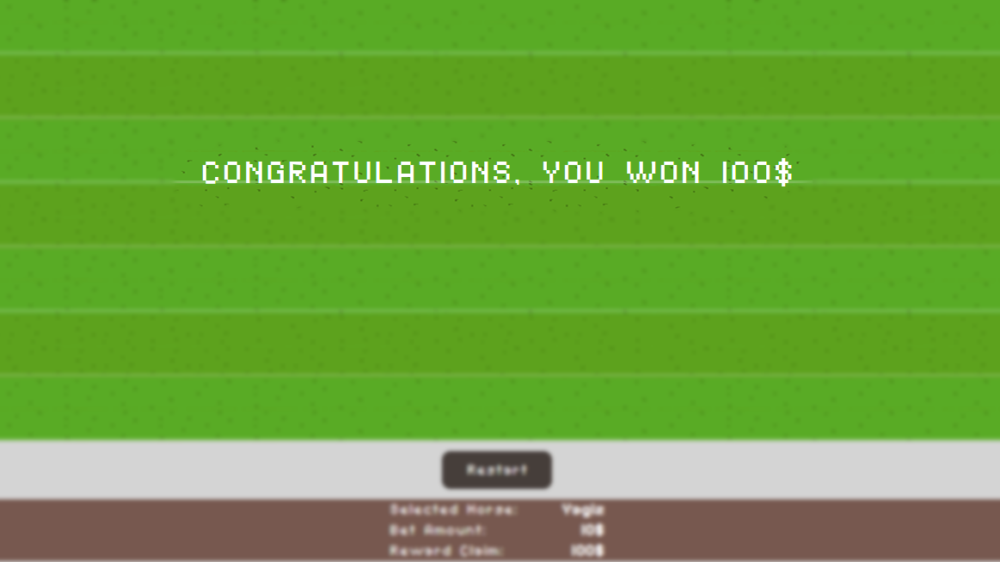